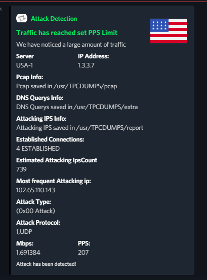
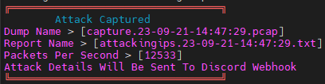

# AutoDumper & Alerter

# How to install
You need python3 (usally comes with any ubuntu OS)
```
bash install.sh
```
# Running AutoDumper & Alerter
```
systemctl enable discord --now
```

# Discord Webhook:


# UnderAttack Screen


